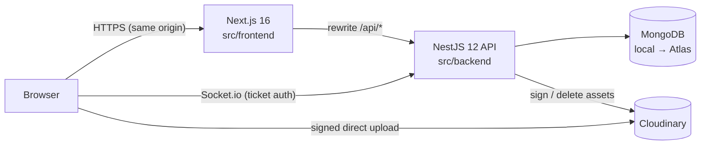

# Architecture

This document is the **contract** between `src/backend` and `src/frontend`. Both sides import their types from
`@spotify/shared`. If a route or payload changes, update this file and the shared types in the same change.

## System overview



- The browser only talks to the Next origin for HTTP. Next rewrites `/api/*` to the API, so auth cookies are
  **first-party** and there is no CORS in production.
- Socket.io connects to `NEXT_PUBLIC_SOCKET_URL` (the API directly). The handshake carries a 60-second **socket ticket**
  from `POST /api/auth/socket-ticket`, fetched again on every reconnect. Cookies are never needed cross-origin.
- Uploads go **browser → Cloudinary** with a signature from the API. The API only stores URLs and public ids.

## Backend layering

```
controller  → HTTP only: routing, DTO validation, Swagger, guards/decorators
service     → business rules, orchestration, transactions
repository  → the ONLY layer that touches Mongoose models (lean queries, aggregations)
schema      → Mongoose schema + indexes
mapper      → document → @spotify/shared response type (no Mongoose docs leave a service)
gateway     → socket events (realtime, chat)
```

Cross-cutting pieces live in `common/` (decorators, guards, filters, pipes, dto, utils, base repository), `config/`
(one file per config area, validated with zod at boot), `bootstrap/` (one setup file per startup concern) and
`infrastructure/` (database, logger, seeds).

## Frontend layering

```
app/        thin routes: params, metadata, render a view
views/      one component per page, composes sections
sections/   page regions (featured, album hero, chat thread, ...)
components/ ui primitives + domain components (music, player, chat, admin, social, layout, auth)
api/        RTK Query: base query (+ reauth), base api, one endpoints file per domain (injectEndpoints)
store/      Redux store, slices (player, realtime, ui), selectors, listener middleware
hooks/      reusable hooks (auth, audio, media session, keyboard, debounce, ...)
providers/  client providers (store, audio, socket, app)
services/   non-React clients: socket, cloudinary upload, storage, audio helpers
schemas/    zod form schemas
lib/ utils/ constants/ config/ types/ styles/
```

Server state = RTK Query cache only (never copied into slices). Realtime events update that cache with
`api.util.updateQueryData`. Audio progress (`currentTime`) stays outside Redux to avoid 4 dispatches per second.

## Auth

| Item | Value |
|---|---|
| Access token | JWT, 15 min, cookie `access_token` (httpOnly, `SameSite=Lax`, `Secure` in prod, path `/`) |
| Refresh token | JWT, 7 days, cookie `refresh_token` (httpOnly, path `/`); stored **hashed** in `sessions`, rotated on every refresh; reusing an old token revokes that session family |
| Socket ticket | JWT, 60 s, separate secret, returned in the body of `POST /auth/socket-ticket` |
| Passwords | argon2id |
| Roles | `user` / `admin` in the `users` collection; emails in `ADMIN_EMAILS` become admin on sign-up/login |
| Route protection (web) | `proxy.ts` checks for the `refresh_token` cookie; the API is the real authority |
| Refresh flow (web) | any 401 → one shared `POST /auth/refresh` (mutex) → retry; if refresh fails → clear state, go to `/login` |

## Error format

Every error response is an `ApiErrorBody`:
`{ statusCode, message, error, code?, details?, requestId?, path?, timestamp }`.
Validation errors put the field errors in `details`.

## REST API (prefix `/api`)

Auth column: **P** = public, **O** = optional auth (personalised when logged in), **U** = logged-in user, **A** = admin.

| Method | Path | Auth | Body / Query | Response |
|---|---|---|---|---|
| GET | /health | P | | `{ status, uptime, db }` |
| POST | /auth/register | P | `RegisterRequest` | `AuthResponse` + cookies |
| POST | /auth/login | P | `LoginRequest` | `AuthResponse` + cookies |
| POST | /auth/refresh | P (cookie) | | `AuthResponse` + rotated cookies |
| POST | /auth/logout | P | | 204, clears cookies |
| POST | /auth/logout-all | U | | 204 |
| GET | /auth/me | U | | `CurrentUser` |
| GET | /auth/providers | P | | `AuthProvidersResponse` |
| GET | /auth/google | P | | 302 → Google |
| GET | /auth/google/callback | P | | sets cookies, 302 → `WEB_ORIGIN/` |
| POST | /auth/socket-ticket | U | | `SocketTicketResponse` |
| PATCH | /users/me | U | `UpdateProfileRequest` | `CurrentUser` |
| GET | /users | U | `UserListQuery` | `Paginated<PublicUser>` (excludes me) |
| GET | /albums | P | `AlbumListQuery` | `Paginated<Album>` |
| GET | /albums/:id | P | | `AlbumWithTracks` |
| GET | /songs | P | `SongListQuery` | `Paginated<Song>` |
| GET | /songs/:id | P | | `Song` |
| POST | /plays | U | `RecordPlayRequest` | 204 |
| GET | /plays/recent | U | `?limit` | `RecentlyPlayedItem[]` |
| GET | /discovery/featured | P | | `Song[]` |
| GET | /discovery/new-releases | P | `?limit` | `Song[]` |
| GET | /discovery/trending | P | `?limit` | `Song[]` (plays in last 7 days, falls back to all-time) |
| GET | /discovery/made-for-you | O | `?limit` | `Song[]` |
| GET | /search | P | `SearchQuery` | `SearchResults` |
| GET | /library/likes | U | `PageQuery` | `Paginated<Song>` |
| GET | /library/likes/ids | U | | `LikedSongIdsResponse` |
| PUT | /library/likes/:songId | U | | 204 |
| DELETE | /library/likes/:songId | U | | 204 |
| GET | /chat/conversations | U | | `Conversation[]` |
| GET | /chat/conversations/:userId/messages | U | `CursorQuery` | `CursorPage<ChatMessage>` (newest first) |
| POST | /chat/messages | U | `SendMessageRequest` | `ChatMessage` (REST fallback; the socket is the primary path) |
| POST | /chat/conversations/:userId/read | U | | `MarkReadResult` |
| POST | /media/signature | A | `UploadSignatureRequest` | `UploadSignature` |
| POST | /admin/songs | A | `CreateSongRequest` | `Song` |
| PATCH | /admin/songs/:id | A | `UpdateSongRequest` | `Song` |
| DELETE | /admin/songs/:id | A | | 204 |
| POST | /admin/albums | A | `CreateAlbumRequest` | `Album` |
| PATCH | /admin/albums/:id | A | `UpdateAlbumRequest` | `Album` |
| DELETE | /admin/albums/:id | A | `?deleteSongs=true` | 204 |
| GET | /stats/overview | A | | `StatsOverview` |
| GET | /stats/plays | A | `?days=30` | `PlaysPerDay[]` |
| GET | /stats/top-songs | A | `?days=30&limit=10` | `TopSong[]` |

Swagger UI: `/api/docs` (non-production).

## Socket events

Typed in `@spotify/shared` (`ServerToClientEvents`, `ClientToServerEvents`). Each user joins room `userRoom(userId)`,
so every tab or device of that user receives the event.

| Direction | Event | Payload | Notes |
|---|---|---|---|
| S→C | `presence:snapshot` | `PresenceSnapshot` | Sent once on connect |
| S→C | `presence:online` / `presence:offline` | `{ userId }` | Only on the user's first socket in / last socket out |
| S→C | `activity:updated` | `{ userId, activity }` | `activity` null = idle |
| C→S | `activity:update` | `{ songId \| null }` | Server looks up the song; it never trusts client titles |
| C→S | `message:send` | `SendMessageRequest`, ack `SocketAck<ChatMessage>` | Persisted, then emitted to both users' rooms |
| S→C | `message:new` | `ChatMessage` | Also sent to the sender's other tabs |
| C→S | `message:read` | `{ userId }`, ack | Marks messages from `userId` as read |
| S→C | `message:read` | `MarkReadResult` | To the original sender |
| C→S | `typing:start` / `typing:stop` | `{ userId }` | Throttled on the client |
| S→C | `typing:update` | `{ userId, isTyping }` | |

## Data model (MongoDB)

| Collection | Key fields | Indexes |
|---|---|---|
| users | email, name, passwordHash (select:false), googleId, avatarUrl, role | email unique, googleId unique sparse, text(name) |
| sessions | userId, family, tokenHash, userAgent, ip, expiresAt, revokedAt | userId, family, TTL expiresAt |
| albums | title, artist, imageUrl, imagePublicId, releaseYear | text(title, artist), createdAt |
| songs | title, artist, albumId, trackNumber, imageUrl/audioUrl (+publicIds), duration, playCount | text(title, artist), albumId+trackNumber, createdAt, playCount |
| playevents | userId, songId, playedAt | userId+playedAt, songId+playedAt, TTL 180 days |
| likes | userId, songId, createdAt | unique userId+songId, userId+createdAt |
| conversations | participants[2], participantKey, lastMessageId, unread{userId:n} | unique participantKey, participants+updatedAt |
| messages | conversationId, senderId, receiverId, content, clientId, readAt | conversationId+_id, receiverId+readAt, unique senderId+clientId (sparse) |

Transactions are used for multi-document writes (album delete, conversation + message). On a standalone local MongoDB
(no replica set) `TransactionService` runs the same callback without a session. Atlas always uses real transactions.
